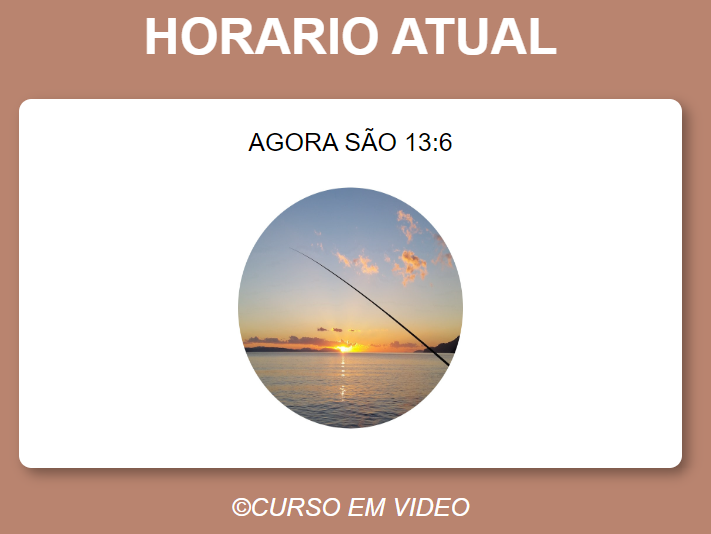

# HORARIO ATUAL
👨‍🏫PROJETO FEITO PARA O CURSO DE JAVASCRIPT DO CURSO EM VIDEO.

  

## DESCRIÇÃO:
O projeto "Horário Atual" exibe uma mensagem com o horário atual e uma imagem correspondente à parte do dia: manhã, tarde ou noite. Este projeto utiliza JavaScript para obter o horário atual e modificar dinamicamente a exibição com base no horário do dia. Ele oferece uma experiência interativa e visualmente agradável para os usuários, refletindo o período do dia em que estão acessando o site. Aqui estão os principais recursos do projeto:

- **Exibição do Horário Atual:**
  - Ao carregar a página, o projeto exibe a hora atual, incluindo horas e minutos.

- **Imagem de Fundo Dinâmica:**
  - Dependendo do horário do dia, uma imagem de fundo correspondente é exibida: manhã, tarde ou noite.

## EXECUTANDO O PROJETO:
1. Abra o arquivo `CODIGO.html` em um navegador da web.
2. O projeto exibirá automaticamente o horário atual e a imagem correspondente.
3. Observe como a imagem de fundo muda de acordo com o horário do dia:
   - Pela manhã, uma imagem de fundo representando a manhã é exibida.
   - Durante a tarde, uma imagem de fundo representando a tarde é exibida.
   - À noite, uma imagem de fundo representando a noite é exibida.

## NÃO SABE?
- Entendemos que para manipular arquivos em `HTML`, `CSS` e outras linguagens relacionadas, é necessário possuir conhecimento nessas áreas. Para auxiliar nesse aprendizado, oferecemos cursos gratuitos disponíveis:
* [CURSO DE HTML E CSS](https://github.com/VILHALVA/CURSO-DE-HTML-E-CSS)
* [CURSO DE JAVASCRIPT](https://github.com/VILHALVA/CURSO-DE-JAVASCRIPT)
* [CONFIRA MAIS CURSOS](https://github.com/VILHALVA?tab=repositories&q=+topic:CURSO)

## CREDITOS:
- [PROJETO FEITO PELO VILHALVA](https://github.com/VILHALVA)
- [PROJETO FEITO PARA O CURSO DE JAVASCRIPT](https://github.com/VILHALVA/CURSO-DE-JAVASCRIPT)
- [ESTÁ DISPONIVEL NO SITE](https://vilhalva.github.io/STYLER/STYLER.html)
